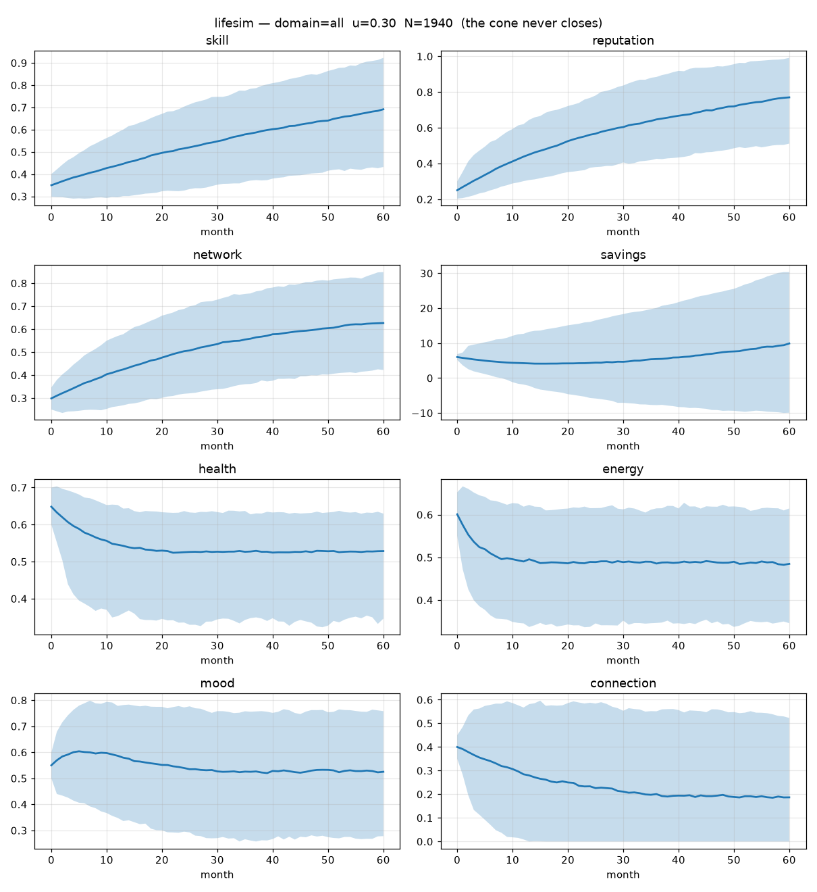

# lifesim

A Monte Carlo simulator for a human life trajectory. Given initial conditions, it
rolls forward to a horizon under uncertainty, samples many trajectories, and
reports the **distribution** of outcomes across life-domains — career, love,
health — coupled together.

## Read this first (the caveats are the point)

lifesim is a toy for **structured thinking with explicit error bars**. It is
**not a predictor**, and every design choice exists to stop it from pretending to
be one:

- **The cone never closes.** There is an irreducible noise floor, so no setting
  can ever produce a point prediction. The report tells you how many times *wider*
  the outcome fan got over the horizon — that number is the honesty.
- **`u` buys resolution, not truth.** Turning up uncertainty widens the modeled
  distribution and runs *more* samples to resolve it; it does not make the tool
  more right. Compute is roughly proportional to `u`.
- **No single "life score".** Every outcome variable is reported separately. The
  tool exists to surface tradeoffs (career vs love, grind vs health); collapsing
  them into one number would hide exactly what you came for.
- **The biggest variable is the one you didn't model.** Past the near term, real
  lives are dominated by things nobody wrote down. Treat long horizons as
  brainstorming, not forecast.

## Install / requirements

Pure Python **3.10+**, standard library only for the core. No install step.

```bash
python3 -m lifesim --domain all --u 0.3 --seed 1
```

`matplotlib` (for `--plot`) and JSON scenario files are **optional** and
import-guarded — the simulator runs on a bare interpreter without them.



*The percentile fan from `--domain all --u 0.3 --seed 1`: each subplot is one
outcome variable, the shaded band is p5–p95, the line is the median. Note the
cones widening with the horizon, and connection declining as the default
work-leaning policy crowds it out.*

## The uncertainty knob `u`

`u ∈ [0, 1]` scales two things at once:

1. **Per-step noise magnitude** — `noise_scale = epistemic_floor + u·0.10`,
   strictly positive even at `u=0`.
2. **Trajectory count `N`** — linear from `n_min=200` at `u=0` to `n_max=6000` at
   `u=1`. You pay for resolution in samples.

## Usage

```
python3 -m lifesim [options]

--domain {career,love,all}   which slice of life to track (default: all)
--u FLOAT                     uncertainty 0..1 (default: 0.3)
--t INT                       horizon in months (default: 60)
--seed INT                    fixed seed => byte-identical output
--n-min INT                   trajectory count at u=0 (default: 200)
--n-max INT                   trajectory count at u=1 (default: 6000)
--event-rate-scale FLOAT      positive event-rate calibration multiplier
--policy "work=..,love=..,health=..,explore=.."   attention allocation (renormalized)
--compare grind,balanced,...  rank named policies by median/spread/CVaR/regret
--scenario PATH               load a JSON scenario (person + knobs)
--from-state PATH             resume from an observed state (re-planning loop)
--convergence                 compare horizon percentiles against a larger-N run
--convergence-factor FLOAT    sample multiplier for --convergence (default: 2)
--sweep u=0:1:0.1             sensitivity sweep over u or one policy weight
--plot [PATH]                 save a percentile-fan plot (needs matplotlib)
```

### Examples

```bash
# Baseline distribution across all domains
python3 -m lifesim --domain all --u 0.3 --seed 1

# A specific allocation of attention (weights renormalize to 1)
python3 -m lifesim --policy "work=0.7,love=0.1,health=0.1,explore=0.1" --seed 1

# Which policy do I regret least in the worst case?
python3 -m lifesim --compare grind,balanced,relationship_first,explore_heavy --seed 1

# More statistically precise about the model's own fan
python3 -m lifesim --t 12 --n-max 12000 --convergence --seed 1

# Run from a saved scenario
python3 -m lifesim --scenario examples/default.json --seed 1

# How sensitive is the outcome to turning up uncertainty?
python3 -m lifesim --domain career --sweep "u=0:1:0.25" --seed 1
```

## Making a run more precise

Do it by tightening the setup and checking sampling error, not by pretending the
future has less irreducible uncertainty:

- Use a shorter horizon with `--t`; near-term fans are naturally narrower.
- Increase `--n-min` / `--n-max`; this reduces Monte Carlo sampling error.
- Add `--convergence` to compare the current percentiles with a larger-N run.
- Use `--from-state` every few weeks with observed state values; re-plan from
  reality instead of trusting one long open-loop rollout.
- Calibrate `--event-rate-scale` or the scenario JSON value when you have a
  reason to believe the context is more or less shock-prone than default.

## Reading the output

**Distribution block** — per tracked variable at the horizon: p5 / p50 / p95 and
the cone width (p95−p5).

**Bell-curve world rarity block** —
- Shows the current modeled state and horizon p5 / median / p95 against a simple
  normal reference population for each outcome variable.
- *world <=* is the percentage of that illustrative world reference at or below
  the value.
- *top %* is the percentage at least as good as that value. It is printed and
  exported with full meaningful float precision rather than rounded to two
  decimals. The reference itself is still a modeling assumption, not census
  truth.

**Monte Carlo precision block** —
- *MC SE*: standard error of the sample mean; lower means the simulation sampled
  the model's distribution more precisely.
- *split Δmax*: largest p5/p50/p95 difference between even and odd trajectories;
  a quick percentile stability check. If this is large relative to the cone, run
  more trajectories or use `--convergence`.

**Honesty block** —
- *Fan ratio*: how many times wider the cone is at the horizon vs. month 1.
- *Surprise index*: fraction of simulated lives that hit ≥1 rare event
  (breakthrough / layoff / health shock / windfall). Over multi-year horizons this
  saturates near 100% — over a long enough window almost everyone gets hit by
  *something*, which is itself the point.
- *Rare types per life*: average number of distinct rare event types (0–4) a life
  saw. This keeps discriminating after the surprise fraction has pinned at 100%:
  two horizons can both read 100% while one averages 1.2 rare types and the other
  3.1.

**Policy comparison** (`--compare`) — per outcome variable: median, spread (std),
downside **CVaR** (mean of the worst 5% in the bad direction — low for
higher-is-better metrics, high for debt/stress/burnout/loneliness), and
**regret**. No column is a total: one policy owns the skill floor, another owns
the connection floor, and choosing between them is your call, not the tool's.

## Policies

A policy allocates finite attention over `work`, `love`, `health`, `explore`,
summing to 1. Named presets: `grind`, `balanced`, `relationship_first`,
`explore_heavy`. Attention is finite, so spending on work is *literally* not
spending on love — that crowd-out is mechanical in the dynamics, not decorative.

## Re-planning (the model-predictive loop)

Don't trust one 60-month roll. Instead:

1. Simulate forward to see the fan.
2. Live a few months for real.
3. Write down where you **actually** landed as a JSON state file:
   ```json
   {"skill": 0.62, "reputation": 0.55, "network": 0.5, "savings": 9.0,
    "health": 0.6, "energy": 0.5, "mood": 0.58, "connection": 0.3, "luck": 0.5}
   ```
4. Re-simulate from there — no starting jitter, because an observed state is data,
   not a guess:
   ```bash
   python3 -m lifesim --from-state state.json --domain all --t 24 --seed 1
   ```

Repeat every few weeks. You are steering against reality, not a forecast.

## Scenarios

A scenario JSON bundles a person and their run knobs:

```json
{
  "domain": "all",
  "horizon_months": 60,
  "uncertainty": 0.3,
  "n_min": 200,
  "n_max": 6000,
  "event_rate_scale": 1.0,
  "overrides": { "skill": 0.6, "savings": 12.0 },
  "policy": { "work": 0.5, "love": 0.1, "health": 0.2, "explore": 0.2 }
}
```

See `examples/default.json` and `examples/scenario_template.json`. Load/save
round-trips losslessly.

## The model, briefly

The model tracks core state (`skill`, `reputation`, `network`, `health`,
`energy`, `mood`, `connection`, plus latent `luck`) and concrete metrics for
money (`cash_usd`, `debt_usd`, `investments_usd`, `net_worth_usd`,
`annual_income_usd`, `monthly_burn_usd`), time freedom (`work_hours_per_week`,
`free_hours_per_week`, `schedule_control`), stress/recovery (`stress`,
`burnout_risk`, `sleep_quality`, `recovery_capacity`), relationship depth
(`romantic_connection`, `friendship_depth`, `family_support`, `loneliness`), and
physical condition (`fitness`, `chronic_health_risk`, `sleep_hours`). Derived
diagnostics (`optionality`, `luck_surface_area`, `downside_fragility`,
`bottleneck_pressure`) are recomputed from the raw metrics rather than evolved as
independent scores.

The coupling graph is still the point: energy gates skill gains, work crowds out
connection and time freedom, career capital compounds into income, mood scales
downstream effects, and financial stress depresses mood. Discrete **events** add
the fat tails. This coupling is what makes a trajectory a life instead of N
independent random walks.

## Development

```bash
python3 -m tests.run     # zero-dependency harness; also works under pytest
```

Core is pure standard library, single seeded RNG threaded explicitly (fixed seed
⇒ reproducible), every module under ~250 lines, bounded variables clamped to
`[0,1]`. The honesty properties are encoded as test invariants, not vibes.
